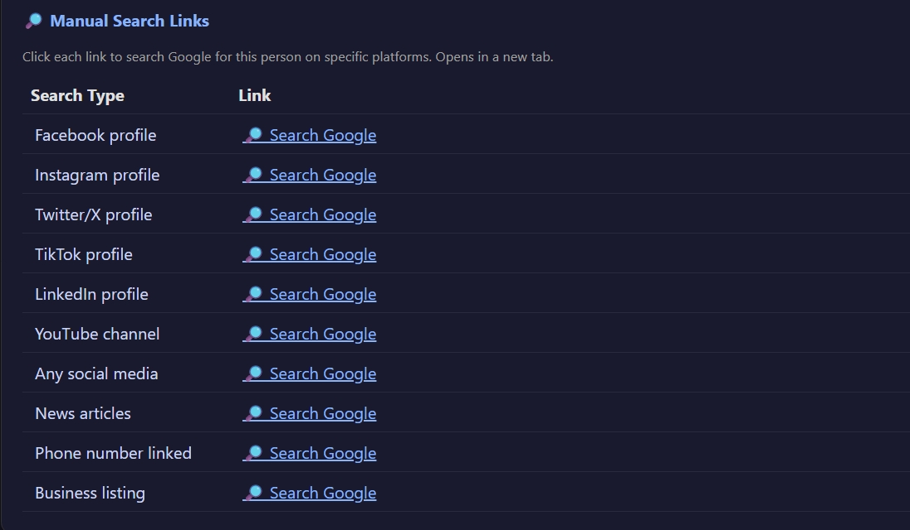
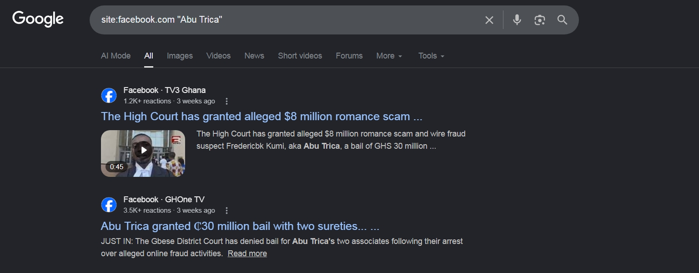
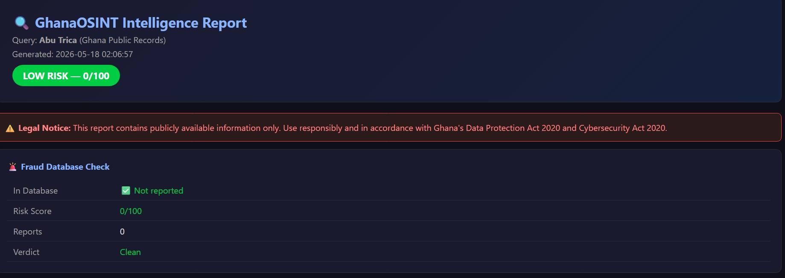

# GhanaOSINT 🔍

A Ghana-focused OSINT and fraud investigation tool.
Built to help identify MoMo scammers and fraudsters.

## Features
- Phone number intelligence (network detection, MoMo check)
- Email analysis (breach check, domain analysis)
- Username/Name search across 60+ platforms
- Google dork search links for manual investigation
- Ghana Public Records (Police, Business Registry, Court, News)
- Community fraud reporting database
- Professional HTML evidence reports

## Screenshots

### Main Menu

### Phone Investigation

### Username Search

### Ghana Public Records

### HTML Report

## Modules
- main.py          — main menu and controller
- phone_intel.py   — phone number analysis
- email_intel.py   — email investigation
- username_search.py — social media search
- fraud_db.py      — local fraud database
- ghana_records.py — Ghana public records
- reporter.py      — HTML report generator

## Legal Notice
For authorized and ethical use only.
Complies with Ghana Data Protection Act 2020
and Cybersecurity Act 2020.
Only searches publicly available information.

## How to Run
pip install requests colorama beautifulsoup4 phonenumbers
python main.py

## Built By
ashardrach — Ghanaian cybersecurity student
GitHub: github.com/ashardrach